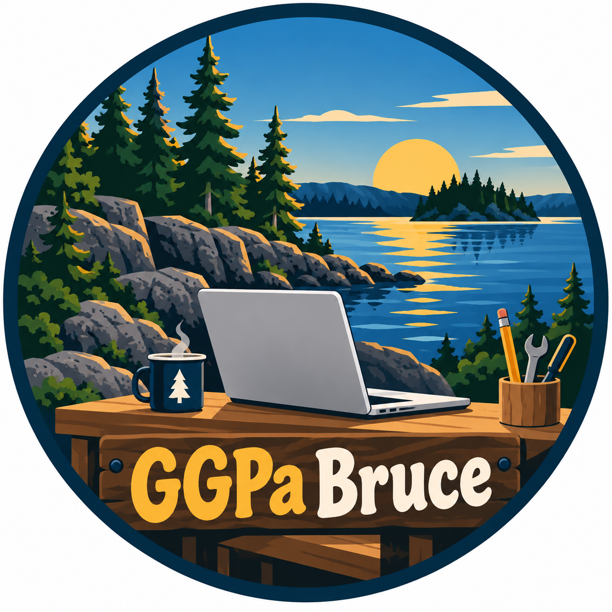
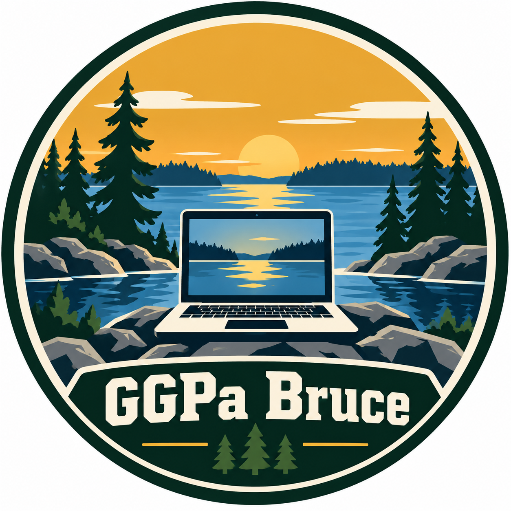
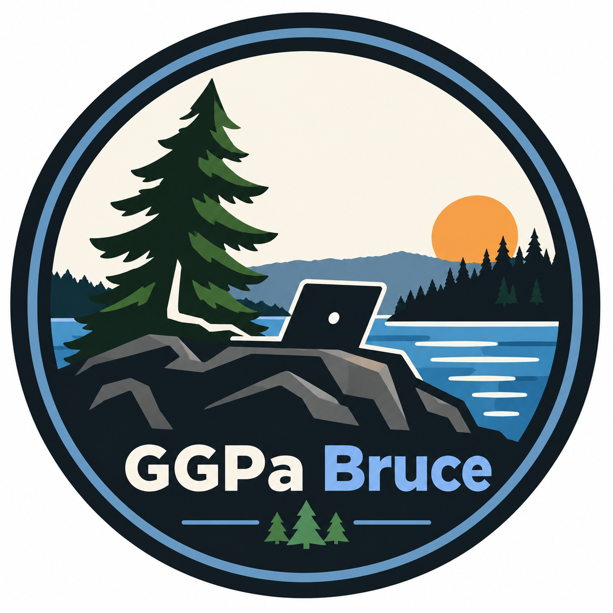

# GGPa Bruce

Choose an organization image (or work with ChatGPT to create one):







## Favicons

Choose a favicon image to appear in the browser tab of your inventions.


Go to [favicon-generator](https://favicon.io/favicon-generator/).

```text
Text = GB

Background = Rounded

Font Family (view all on
[Google Fonts](https://fonts.google.com/)) = Madimi One

Font Variant = Regular 400 Normal

Font Size = 110

Font Color = #F00 (red)

Background Color = #FFF (white)
```
